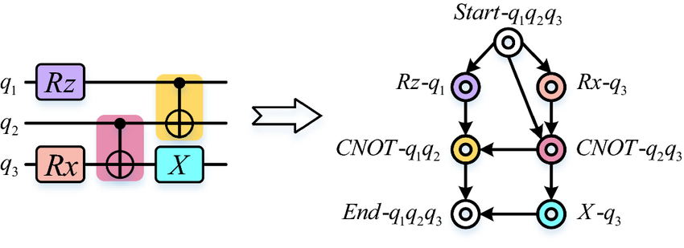
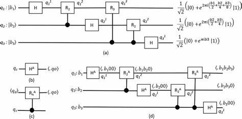
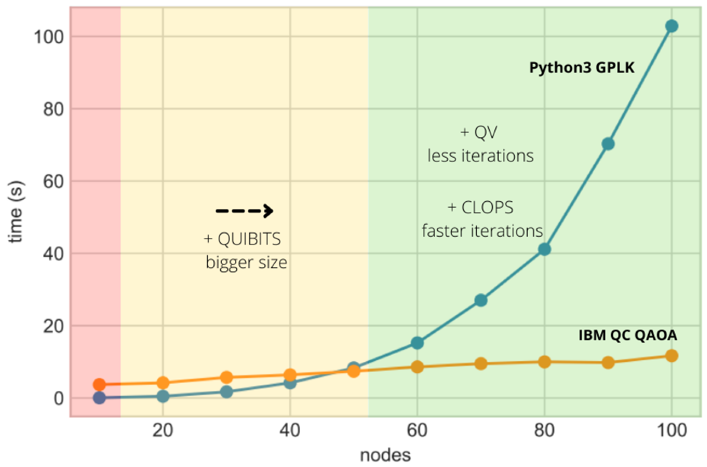

# QUBO Calculator: A Quantum Renaissance in Computation and Cryptography

Welcome to the **QUBO Calculator**, a deeply engineered repository at the intersection of theoretical quantum mechanics, quantum computing, and cryptographic deconstruction. This isn’t a project—it’s a **postulate in code**, a computational reflection of Dirac’s bra-ket formalism and Feynman’s simulation dreams.

> Crafted with the precision of a researcher, the complexity of a doctoral thesis, and the vision of a quantum future.

---

## 🧠 Quantum Project Philosophy

This repository doesn’t just implement algorithms; it **translates the deepest quantum phenomena** into executable logic:

- **Factoring integers with Shor’s Algorithm**, revealing the instability of RSA.
- **Extracting eigenphases with Quantum Phase Estimation (QPE)** to reconstruct the core idea of energy-level simulation.
- **Implementing Quantum Fourier Transform (QFT)** from first principles.
- **Solving QUBO formulations via QAOA**, proving how combinatorial optimization can be morphed into a quantum-native task.

It is a research-ready platform, architected for those who not only **use** quantum computing — but **understand it.**

---

## 🧬 Core Quantum Modules (Implemented in Full Fidelity)

### 1. Shor's Algorithm – Periodicity-Based Factorization
Shor’s algorithm decomposes RSA-challenging integers using **modular exponentiation** and **quantum period finding**, followed by a classical **continued fractions** algorithm to extract the correct order \( r \):

```python
factor_integer(21)  # Output: [3, 7]
```

Internally, it constructs superpositions of modular exponentials and applies an **inverse QFT** to extract the period.

**Quantum Circuit Visualization:**

)

**Mathematical Workflow:**
\[
\text{Find period } r \text{ such that } a^r \equiv 1 \ (\text{mod } N)
\]
\[
\text{Then use GCD}(a^{r/2} \pm 1, N) \Rightarrow \text{factors of } N
\]

---

### 2. Quantum Fourier Transform (QFT)
This implementation of the QFT operates in-place, building the recursive decomposition from Hadamard gates and controlled phase shifts:

```python
create_qft_circuit(n_qubits=3)
```

**Quantum Circuit:**


**Core Transformation:**
\[
|x\rangle \rightarrow \frac{1}{\sqrt{2^n}} \sum_{y=0}^{2^n-1} e^{2\pi i xy / 2^n} |y\rangle
\]

It’s the foundation for every periodic function sampling in quantum space.

---

### 3. Quantum Phase Estimation (QPE)
The QPE algorithm encodes a unitary operator’s eigenvalue phase into a readout register using **controlled unitaries** and an **inverse QFT**:

```python
qc = qpe_circuit(unitary, eigenstate, n_count=4)
simulate_qpe(qc)
```

**Circuit Layout:**


This is used in:
- **Quantum chemistry** for molecular ground-state energies.
- **Hamiltonian simulation** for solving differential quantum systems.

---

### 4. QUBO Solver via QAOA
The QUBO (Quadratic Unconstrained Binary Optimization) problem is translated into an **Ising Hamiltonian**, and solved via **Quantum Approximate Optimization Algorithm (QAOA)**:

```python
solution, cost = simple_qubo_problem()
```

**Architecture:**
- Cost layer: encodes QUBO objective into a cost Hamiltonian
- Mixer layer: drives state transitions across bitstrings
- Parameter optimization: uses classical optimizers like COBYLA/SPSA

**QAOA Optimization Visualization:**


**Mathematical Model:**
\[
H_{QUBO} = \sum_i Q_{ii} x_i + \sum_{i \neq j} Q_{ij} x_i x_j
\]

---

## 🧪 Project Directory Anatomy

```
qubo-calculator/
├── src/                        # Core quantum implementations
│   ├── shor_algorithm.py       # Shor’s algorithm from scratch
│   ├── qft_module.py           # QFT and its inverse
│   ├── qpe_module.py           # Full QPE with simulation
│   └── qubo_solver.py          # QUBO optimization using QAOA
│
├── main.py                     # Unified driver to showcase all algorithms
├── requirements.txt            # Reproducible environment setup
├── .gitignore                  # Clean commits and deploys
├── LICENSE                     # MIT-licensed
└── notebooks/
    └── demo_playground.ipynb   # Interactive notebook for experimentation
```

---

## 🔧 Installation

Clone and install:
```bash
git clone https://github.com/yourusername/qubo-calculator.git
cd qubo-calculator
pip install -r requirements.txt
python main.py
```

Launch the visual notebook:
```bash
jupyter notebook notebooks/demo_playground.ipynb
```

---

## 🚀 Execution Showcase

Run a full simulation sequence:
```bash
python main.py
```
This will:
- Factor `21` with Shor’s
- Show 3-qubit QFT
- Estimate a phase using QPE
- Solve a QUBO optimization instance

---

## 📚 Quantum Concepts Covered

| Concept                        | Applied In                            |
|-------------------------------|----------------------------------------|
| Modular Exponentiation        | Shor’s Algorithm                       |
| Continued Fractions           | Post-processing of period              |
| Entanglement & Interference   | QFT, QPE, QAOA                         |
| Eigenvalue Decomposition      | QPE                                    |
| Binary Optimization Encoding  | QUBO via QAOA                          |
| Classical-Quantum Hybrids     | QAOA Parameter Tuning                  |

---

## 📌 Target Use-Cases
- Quantum Cryptanalysis
- Optimization Theory Research
- Advanced Quantum Circuit Design
- Doctoral Thesis Demonstrations
- Final-Year Research Submissions

---
