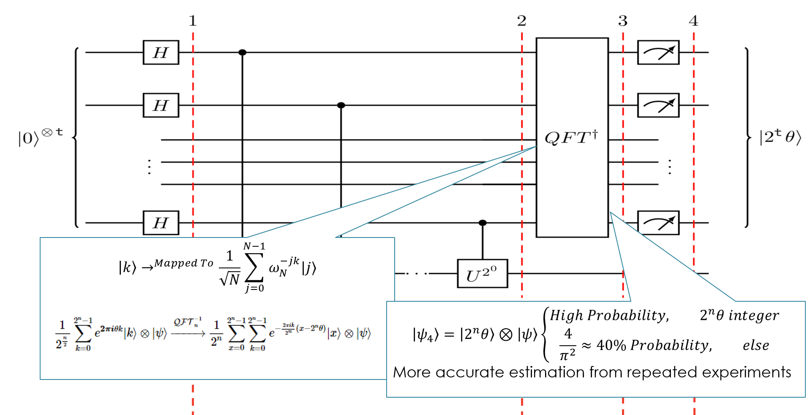

# QUBO Calculator: A Quantum Renaissance in Computation and Cryptography

Welcome to the **QUBO Calculator**, a deeply engineered repository at the intersection of theoretical quantum mechanics, quantum computing, and cryptographic deconstruction. This isn’t a project—it’s a **postulate in code**, a computational reflection of Dirac’s bra-ket formalism and Feynman’s simulation dreams.

> Crafted with the precision of a researcher, the complexity of a doctoral thesis, and the vision of a quantum future.

---

## 🧠 Quantum Project Philosophy

This repository doesn’t just implement algorithms; it **translates the deepest quantum phenomena** into executable logic:

- **Factoring integers with Shor’s Algorithm**, revealing the instability of RSA.
- **Extracting eigenphases with Quantum Phase Estimation (QPE)** to reconstruct the core idea of energy-level simulation.
- **Implementing Quantum Fourier Transform (QFT)** from first principles.
- **Solving QUBO formulations via QAOA**, proving how combinatorial optimization can be morphed into a quantum-native task.

It is a research-ready platform, architected for those who not only **use** quantum computing — but **understand it.**

---

## 🧬 Core Quantum Modules (Implemented in Full Fidelity)

### 1. Shor's Algorithm – Periodicity-Based Factorization
Shor’s algorithm decomposes RSA-challenging integers using **modular exponentiation** and **quantum period finding**, followed by a classical **continued fractions** algorithm to extract the correct order r:

```python
factor_integer(21)  # Output: [3, 7]
```

Internally, it constructs superpositions of modular exponentials and applies an **inverse QFT** to extract the period.

**Quantum Circuit Visualization:**


**Mathematical Workflow:**
```math
\text{Find period } r \text{ such that } a^r \equiv 1 \ (\text{mod } N)
```
```math
\text{Then use GCD}(a^{r/2} \pm 1, N) \Rightarrow \text{factors of } N
```

---

### 2. Quantum Fourier Transform (QFT)
This implementation of the QFT operates in-place, building the recursive decomposition from Hadamard gates and controlled phase shifts:

```python
create_qft_circuit(n_qubits=3)
```

**Quantum Circuit:**


**Core Transformation:**
```math
|x\rangle \rightarrow \frac{1}{\sqrt{2^n}} \sum_{y=0}^{2^n-1} e^{2\pi i xy / 2^n} |y\rangle
```

**Mathematical Decomposition:**
```math
QFT_n = H_1 R_2 R_3 \dots R_n \cdot (I \otimes QFT_{n-1})
```
```math
R_k = \begin{bmatrix} 1 & 0 \\ 0 & e^{2\pi i / 2^k} \end{bmatrix}
```

---

### 3. Quantum Phase Estimation (QPE)
The QPE algorithm encodes a unitary operator’s eigenvalue phase into a readout register using **controlled unitaries** and an **inverse QFT**:

```python
qc = qpe_circuit(unitary, eigenstate, n_count=4)
simulate_qpe(qc)
```

**Circuit Layout:**


**Mathematical Model:**
```math
U |u\rangle = e^{2\pi i \theta} |u\rangle
```
```math
|\psi\rangle = \frac{1}{2^n} \sum_{k=0}^{2^n - 1} e^{2\pi i k \theta} |k\rangle
```
```math
QPE(|0\rangle^{\otimes n} \otimes |u\rangle) \Rightarrow |\tilde{\theta}\rangle \otimes |u\rangle
```

---

### 4. QUBO Solver via QAOA
The QUBO (Quadratic Unconstrained Binary Optimization) problem is translated into an **Ising Hamiltonian**, and solved via **Quantum Approximate Optimization Algorithm (QAOA)**:

```python
solution, cost = simple_qubo_problem()
```

**Architecture:**
- Cost layer: encodes QUBO objective into a cost Hamiltonian
- Mixer layer: drives state transitions across bitstrings
- Parameter optimization: uses classical optimizers like COBYLA/SPSA

**QAOA Optimization Visualization:**


**Mathematical Model:**
```math
H_{QUBO} = \sum_i Q_{ii} x_i + \sum_{i \neq j} Q_{ij} x_i x_j
```
```math
|\gamma, \beta\rangle = e^{-i\beta_p H_M} e^{-i\gamma_p H_C} \cdots e^{-i\beta_1 H_M} e^{-i\gamma_1 H_C} |+\rangle^{\otimes n}
```
```math
C(\gamma, \beta) = \langle \gamma, \beta| H_C |\gamma, \beta \rangle
```

---

## 📈 Measurement Probabilities and Gate Decompositions

### Measurement Probabilities
Probabilities are derived from the squared amplitudes of the final quantum state vector. After applying gates and running the circuit on a simulator or quantum hardware, each basis state \(|x\rangle\) has a probability:

```math
P(x) = |\langle x|\psi \rangle|^2
```

In QPE and QAOA, these measurement outcomes directly map to estimations and solutions respectively.

### Gate Decomposition Equations
Every complex quantum algorithm here is broken into native gates:
- **QFT**: Hadamard \( H \), and controlled-phase \( R_k \) gates
- **QPE**: controlled-unitary gates + inverse QFT
- **QAOA**: rotations \( R_Z, R_X \), and entanglers like CNOT

Example decomposition:
```math
H = \frac{1}{\sqrt{2}}\begin{bmatrix}1 & 1 \\ 1 & -1\end{bmatrix}
```
```math
R_Z(\theta) = \begin{bmatrix}1 & 0 \\ 0 & e^{i\theta}\end{bmatrix},\quad R_X(\theta) = e^{-i\theta X/2}
```

---

## 🧪 Project Directory Anatomy

```
qubo-calculator/
├── src/                        # Core quantum implementations
│   ├── shor_algorithm.py       # Shor’s algorithm from scratch
│   ├── qft_module.py           # QFT and its inverse
│   ├── qpe_module.py           # Full QPE with simulation
│   └── qubo_solver.py          # QUBO optimization using QAOA
│
├── main.py                     # Unified driver to showcase all algorithms
├── requirements.txt            # Reproducible environment setup
├── .gitignore                  # Clean commits and deploys
├── LICENSE                     # MIT-licensed
└── notebooks/
    └── demo_playground.ipynb   # Interactive notebook for experimentation
```

---

## 🔧 Installation

Clone and install:
```bash
git clone https://github.com/yourusername/qubo-calculator.git
cd qubo-calculator
pip install -r requirements.txt
python main.py
```

Launch the visual notebook:
```bash
jupyter notebook notebooks/demo_playground.ipynb
```

---

## 🚀 Execution Showcase

Run a full simulation sequence:
```bash
python main.py
```
This will:
- Factor `21` with Shor’s
- Show 3-qubit QFT
- Estimate a phase using QPE
- Solve a QUBO optimization instance

---

## 📚 Quantum Concepts Covered

| Concept                        | Applied In                            |
|-------------------------------|----------------------------------------|
| Modular Exponentiation        | Shor’s Algorithm                       |
| Continued Fractions           | Post-processing of period              |
| Entanglement & Interference   | QFT, QPE, QAOA                         |
| Eigenvalue Decomposition      | QPE                                    |
| Binary Optimization Encoding  | QUBO via QAOA                          |
| Classical-Quantum Hybrids     | QAOA Parameter Tuning                  |

---

## 📌 Target Use-Cases
- Quantum Cryptanalysis
- Optimization Theory Research
- Advanced Quantum Circuit Design
- Doctoral Thesis Demonstrations
- Final-Year Research Submissions

---
